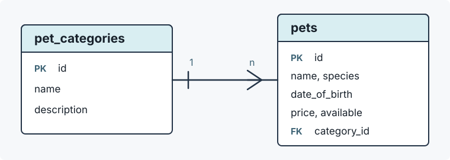

# Tierhandlung

Diese kleine Spring-Boot-Anwendung zeigt eine H2-Datenbank mit Spring Data JPA.
Sie modelliert eine Tierhandlung mit Kategorien und Tieren.

## Lernziele

- Eine In-Memory-H2-Datenbank in Spring Boot konfigurieren
- Tabellen aus JPA-Entitaeten erzeugen
- Startdaten aus `data.sql` laden
- Eine `@ManyToOne`-Beziehung zwischen Tier und Kategorie abbilden
- Eine Beziehung beim Laden eines Tiers direkt mitladen
- Daten ueber REST-Endpunkte lesen und aendern

## Starten

Voraussetzungen:

- Java 21
- Maven

```bash
mvn spring-boot:run
```

Danach ist die Anwendung unter `http://localhost:8080` erreichbar.

## Konfiguration in `application.yml`

Die Datei `src/main/resources/application.yml` enthaelt die zentrale
Spring-Boot-Konfiguration der Beispielanwendung.

```yaml
spring:
  datasource:
    url: jdbc:h2:mem:tierhandlung
  jpa:
    hibernate:
      ddl-auto: create-drop
    defer-datasource-initialization: true
    show-sql: true
    properties:
      hibernate:
        format_sql: true
  h2:
    console:
      enabled: true
```

Die wichtigsten Einstellungen:

| Einstellung | Bedeutung |
| --- | --- |
| `spring.datasource.url` | Verwendet die In-Memory-H2-Datenbank `tierhandlung`. Beim Beenden der Anwendung gehen die Daten verloren. |
| `spring.datasource.username` | Meldet die Anwendung mit dem H2-Benutzer `sa` an. |
| `spring.jpa.hibernate.ddl-auto` | `create-drop` erzeugt die Tabellen beim Start aus den JPA-Entitaeten und entfernt sie beim Stoppen. |
| `spring.jpa.defer-datasource-initialization` | Laedt `data.sql` erst nach dem Erzeugen der Tabellen. |
| `spring.jpa.show-sql` | Gibt SQL-Befehle in der Konsole aus, damit Datenbankzugriffe nachvollziehbar sind. |
| `spring.jpa.properties.hibernate.format_sql` | Uebergibt Hibernate die Einstellung `format_sql=true`. Die SQL-Ausgabe wird dadurch eingerueckt und besser lesbar dargestellt. |
| `spring.h2.console.enabled` | Aktiviert die browserbasierte H2 Console fuer SQL-Abfragen. |

YAML bildet verschachtelte Properties ueber Einrueckungen ab. Die YAML-Zeile
`spring.jpa.show-sql: true` entspricht in einer `.properties`-Datei
`spring.jpa.show-sql=true`.

Der Block `spring.jpa.properties` ist fuer zusaetzliche Eigenschaften des
JPA-Providers gedacht. In diesem Projekt ist Hibernate der JPA-Provider. Darum
wird aus

```yaml
properties:
  hibernate:
    format_sql: true
```

die Hibernate-Einstellung `hibernate.format_sql=true`.

## REST-Endpunkte

| Methode | Pfad | Zweck |
| --- | --- | --- |
| `GET` | `/api/categories` | Kategorien anzeigen |
| `GET` | `/api/pets` | Alle Tiere anzeigen |
| `GET` | `/api/pets?categoryId=1` | Tiere einer Kategorie anzeigen |
| `GET` | `/api/pets/{id}` | Ein Tier anzeigen |
| `POST` | `/api/pets` | Tier anlegen |
| `PUT` | `/api/pets/{id}` | Tier aendern |
| `DELETE` | `/api/pets/{id}` | Tier loeschen |

## Beziehung zwischen Tier und Kategorie

Ein Tier gehoert zu genau einer Kategorie. Die Entitaet `Pet` bildet das mit
einer `@ManyToOne`-Beziehung ab:



```java
@ManyToOne(fetch = FetchType.EAGER, optional = false)
@JoinColumn(name = "category_id", nullable = false)
private PetCategory category;
```

`FetchType.EAGER` haelt das Beispiel einfach: Wenn ein `Pet` geladen wird, ist
seine `PetCategory` direkt verfuegbar. Dadurch kann `PetResponse` neben dem Tier
auch `categoryId` und `categoryName` ausgeben, ohne Lazy Loading zu behandeln.

Beispiel fuer ein neues Tier:

```bash
curl -i http://localhost:8080/api/pets \
  -H 'Content-Type: application/json' \
  -d '{
    "name": "Flocke",
    "species": "Meerschweinchen",
    "dateOfBirth": "2025-11-03",
    "price": 39.90,
    "available": true,
    "categoryId": 1
  }'
```

## H2 Console

Die H2 Console ist nach dem Start unter `http://localhost:8080/h2-console` aktiv.

| Feld | Wert |
| --- | --- |
| JDBC URL | `jdbc:h2:mem:tierhandlung` |
| User Name | `sa` |
| Password | leer |

Zum Einstieg eignen sich diese SQL-Abfragen:

```sql
select * from pet_categories;
select * from pets;

select p.name, p.species, c.name as category
from pets p
join pet_categories c on c.id = p.category_id
order by p.name;
```
